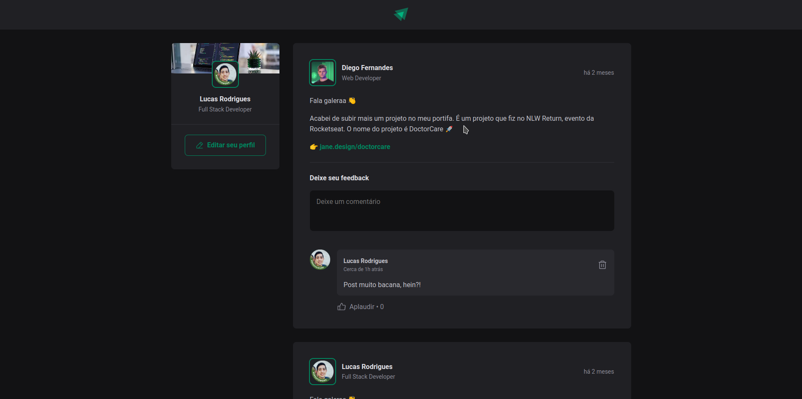

<h1 align="center">
 react-feed
</h1>

  <a href="#-tecnologias">Tecnologias</a>&nbsp;&nbsp;&nbsp;|&nbsp;&nbsp;&nbsp;
  <a href="#-projeto">Projeto</a>&nbsp;&nbsp;&nbsp;|&nbsp;&nbsp;&nbsp;
  <a href="#-layout">Layout</a>&nbsp;&nbsp;&nbsp;|&nbsp;&nbsp;&nbsp;

  

 

## 🚀 Tecnologias

Esse projeto foi desenvolvido com as seguintes tecnologias:

- React.JS
- TypeScript
- Node.JS
- Firebase
- Css.modules
- vite

## 💻 Projeto

Projeto de um feed, onde o usuário pode fazer posts, dar like e interagir.

Feito com ♥ by Lucas Rodrigues
